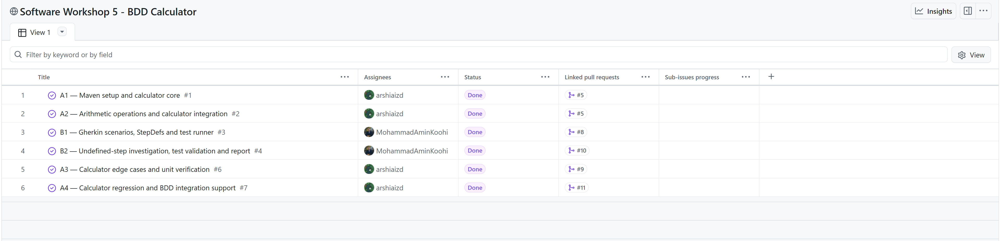
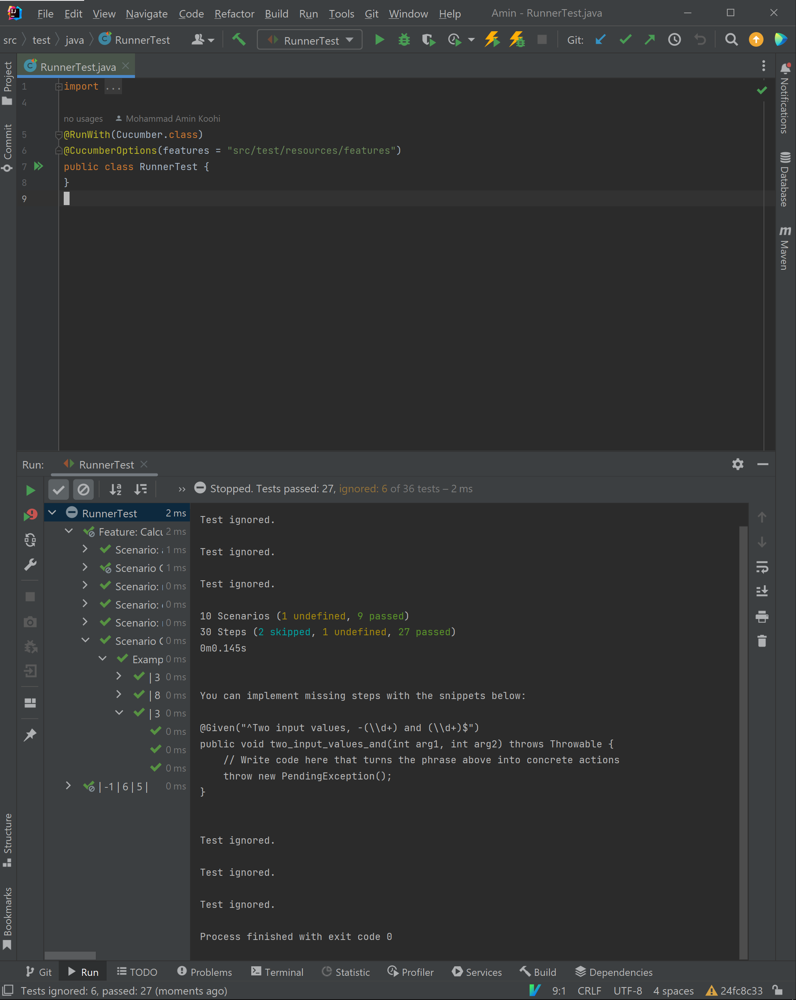
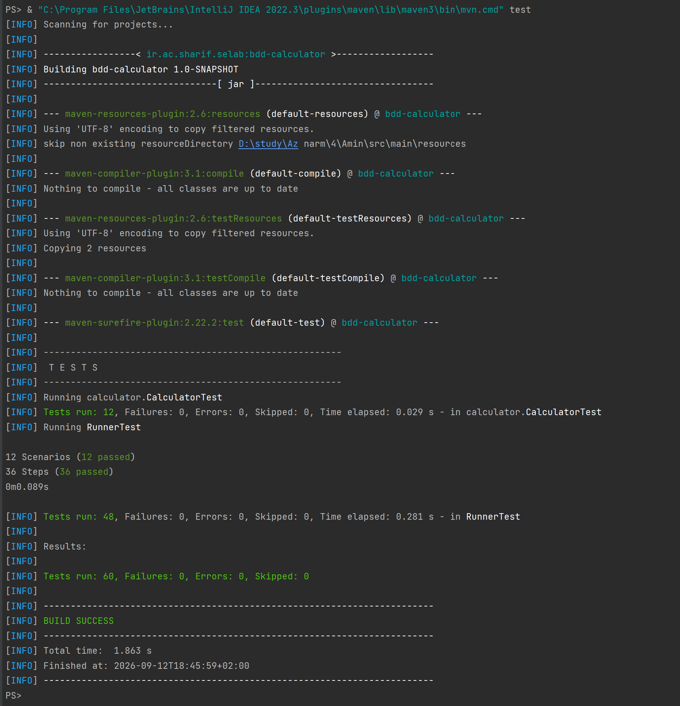
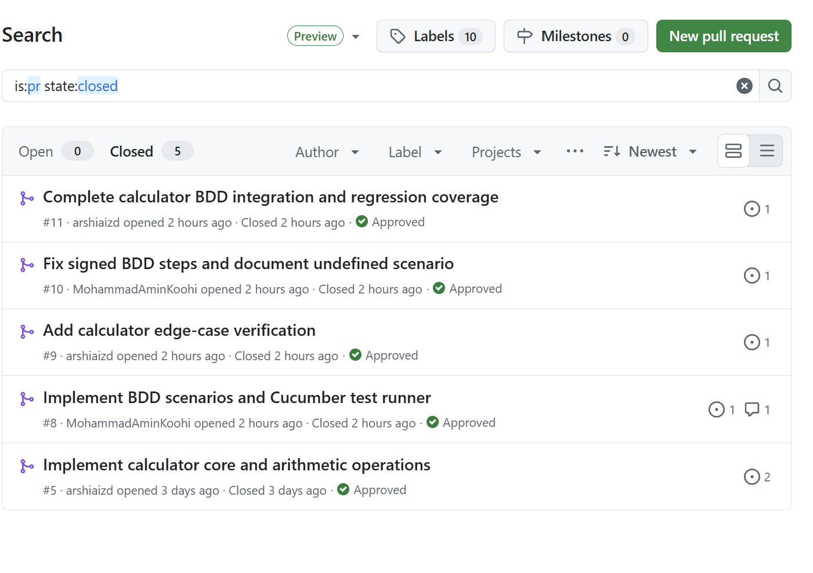

# آزمایشگاه مهندسی نرم‌افزار — BDD و Cucumber

## معرفی پروژه

هدف این تمرین آشنایی عملی با روش توسعهٔ مبتنی بر رفتار یا BDD، نوشتن سناریوهای قابل فهم با زبان Gherkin، اتصال این سناریوها به کد Java با استفاده از Step Definitionها و اجرای تست‌ها با Cucumber و JUnit بود.

در این پروژه یک ماشین‌حساب ساده پیاده‌سازی شد که عملیات جمع، ضرب، تقسیم و توان را انجام می‌دهد. برای بررسی رفتار برنامه ابتدا مثال جمع موجود در صورت تمرین پیاده‌سازی شد و سپس سناریوهای مربوط به عملیات خواسته‌شده شامل ضرب، تقسیم و توان به پروژه اضافه شدند.

علاوه بر Scenarioهای عادی، از Scenario Outline نیز استفاده شد تا چند ورودی مختلف با یک ساختار مشترک آزمایش شوند. در یکی از مثال‌ها مقدار منفی `-1` باعث Undefined شدن یک Step شد که علت آن بررسی و سپس با اصلاح Regular Expression مربوط به Step Definition برطرف شد.

پروژه با Maven مدیریت شده و تست‌های BDD با `Cucumber 1.2.5` و `JUnit 4.12` اجرا شده‌اند.

مخزن عمومی پروژه در آدرس زیر قرار دارد:

[https://github.com/arshiaizd/Software_Workshop_4](https://github.com/arshiaizd/Software_Workshop_4)

## اعضای گروه

ارشیا ایزدیاری با نام کاربری گیتهاب `arshiaizd` و

محمد امین کوهی با نام کاربری گیتهاب `MohammadAminKoohi`.

## تقسیم وظایف

بخش مربوط به ساختار اولیهٔ Maven، پیاده‌سازی کلاس اصلی `Calculator`، عملیات ضرب، تقسیم و توان، تست‌های مستقیم Calculator و بررسی Edge Caseها توسط ارشیا انجام شد. همچنین در بخش پایانی تنظیمات مربوط به سازگاری Cucumber قدیمی با Java جدید و بازآرایی Step Definitionها نیز توسط ارشیا انجام شد.

بخش مربوط به BDD شامل ساخت `RunnerTest`، نوشتن Featureها، Scenarioهای عادی، Scenario Outline، Step Definitionها و بررسی مشکل Undefined Step توسط امین انجام شد.

در ادامه هر عضو Pull Requestهای عضو دیگر را بررسی کرد. PRهای BDD مربوط به امین توسط ارشیا Review شدند و PRهای مربوط به تست‌های Calculator و Integration نیز توسط امین Review و تأیید شدند.

در پایان تاریخچهٔ Git نیز بررسی شد. تعداد Commitهای معنادار و غیر Merge برای هر عضو برابر 10 Commit بود و در مجموع 20 Commit توسعه‌ای وجود داشت. Merge Commitها در این شمارش در نظر گرفته نشدند.

## ساختار پروژه

نسخهٔ نهایی پروژه شامل فایل‌های اصلی زیر است:

```text
.
├── pom.xml
├── README.md
├── docs
│   └── bdd-undefined-step-report-fa.md
└── src
    ├── main
    │   └── java
    │       └── calculator
    │           └── Calculator.java
    └── test
        ├── java
        │   ├── RunnerTest.java
        │   └── calculator
        │       ├── CalculatorStepDefinitions.java
        │       └── CalculatorTest.java
        └── resources
            └── features
                └── calculator.feature
```

فایل `Calculator.java` شامل منطق اصلی ماشین‌حساب است. فایل `calculator.feature` سناریوهای BDD را با زبان Gherkin نگهداری می‌کند و `CalculatorStepDefinitions.java` ارتباط بین جملات Gherkin و متدهای Java را برقرار می‌کند.

فایل `RunnerTest.java` نیز Runner مربوط به Cucumber است و تمام Featureهای موجود در مسیر `src/test/resources/features` را اجرا می‌کند.

فایل `CalculatorTest.java` نیز شامل تست‌های مستقیم JUnit برای بررسی عملیات و Edge Caseهای Calculator است.

## تنظیم Maven و وابستگی‌ها

برای مدیریت پروژه از Maven استفاده شد. وابستگی‌های اصلی مورد استفاده در `pom.xml` شامل Cucumber و JUnit هستند:

```xml
<dependency>
    <groupId>info.cukes</groupId>
    <artifactId>cucumber-junit</artifactId>
    <version>1.2.5</version>
    <scope>test</scope>
</dependency>

<dependency>
    <groupId>junit</groupId>
    <artifactId>junit</artifactId>
    <version>4.12</version>
    <scope>test</scope>
</dependency>

<dependency>
    <groupId>info.cukes</groupId>
    <artifactId>cucumber-java</artifactId>
    <version>1.2.5</version>
    <scope>test</scope>
</dependency>
```

نسخهٔ Source و Target پروژه نیز مطابق صورت تمرین روی Java 8 تنظیم شده است:

```xml
<maven.compiler.source>1.8</maven.compiler.source>
<maven.compiler.target>1.8</maven.compiler.target>
```

با توجه به قدیمی بودن Cucumber 1.2.5، اجرای آن روی Javaهای جدید نیاز به دسترسی به تعدادی Module داخلی Java داشت. برای اینکه اجرای عادی دستور `mvn test` بدون وارد کردن Optionهای اضافی در خط فرمان انجام شود، تنظیمات لازم در `maven-surefire-plugin` قرار داده شد.

به این ترتیب پروژه در اجرای نهایی با Java 17 نیز بدون نیاز به وارد کردن دستی `--add-opens` اجرا می‌شود.

## کلاس Calculator

کلاس اصلی ماشین‌حساب شامل چهار عملیات مورد استفاده در تمرین است:

```java
public class Calculator {

    public int add(int first, int second) {
        return first + second;
    }

    public int multiply(int first, int second) {
        return first * second;
    }

    public int divide(int first, int second) {
        return first / second;
    }

    public int power(int base, int exponent) {
        int result = 1;
        for (int i = 0; i < exponent; i++) {
            result *= base;
        }
        return result;
    }
}
```

عملیات توان بدون استفاده از `Math.pow` و با ضرب تکراری پیاده‌سازی شده است.

تقسیم نیز به صورت Integer Division در Java انجام می‌شود و در صورت تقسیم بر صفر، رفتار طبیعی Java یعنی `ArithmeticException` حفظ شده است.

## سناریوی اولیهٔ جمع

در ابتدا سناریوی مرجع مربوط به جمع دو عدد مطابق صورت تمرین اضافه شد:

```gherkin
Scenario: add two numbers
  Given Two input values, 1 and 2
  When I add the two values
  Then I expect the result 3
```

در این سناریو ابتدا دو ورودی 1 و 2 در Step مربوط به `Given` دریافت می‌شوند، سپس متد `add` از Calculator اجرا می‌شود و در مرحلهٔ `Then` بررسی می‌شود که نتیجه برابر 3 باشد.

## Scenario Outline برای جمع

برای اجرای یک سناریوی یکسان روی چند مجموعه داده، از Scenario Outline استفاده شد:

```gherkin
Scenario Outline: add pairs of numbers
  Given Two input values, <first> and <second>
  When I add the two values
  Then I expect the result <result>

  Examples:
    | first | second | result |
    | 1     | 12     | 13     |
    | -1    | 6      | 5      |
    | 2     | 2      | 4      |
    | 8     | -3     | 5      |
    | -4    | -5     | -9     |
```

سه ردیف اول شامل مثال‌های اصلی تمرین هستند و در ادامه چند حالت دارای عدد منفی نیز برای بررسی بهتر رفتار Step Definition اضافه شدند.

استفاده از Scenario Outline باعث می‌شود بدون تکرار کامل Given، When و Then بتوان چند ورودی مختلف را آزمایش کرد.

## سناریوهای ماشین‌حساب

برای بخش دوم تمرین سه Scenario عادی برای ضرب، تقسیم و توان نوشته شد.

سناریوی ضرب:

```gherkin
Scenario: multiply two numbers
  Given Two input values, 6 and 2
  When I multiply the two values
  Then I expect the result 12
```

سناریوی تقسیم:

```gherkin
Scenario: divide two numbers
  Given Two input values, 6 and 2
  When I divide the two values
  Then I expect the result 3
```

سناریوی توان:

```gherkin
Scenario: raise a number to a power
  Given Two input values, 6 and 2
  When I raise the first value to the second value
  Then I expect the result 36
```

بنابراین سه رفتار اصلی خواسته‌شده در صورت تمرین یعنی:

```text
6 * 2 = 12
6 / 2 = 3
6 ^ 2 = 36
```

به صورت مستقل در BDD بررسی شدند.

علاوه بر این موارد، یک Scenario Outline دیگر نیز برای عملیات مختلف نوشته شد:

```gherkin
Scenario Outline: calculate supported positive-value operations
  Given Two input values, <first> and <second>
  When I perform the <operation> operation
  Then I expect the result <result>

  Examples:
    | first | second | operation | result |
    | 3     | 4      | multiply  | 12     |
    | 8     | 2      | divide    | 4      |
    | 3     | 3      | power     | 27     |
```

## Step Definitionها

برای اتصال سناریوهای Gherkin به کد Java از کلاس `CalculatorStepDefinitions` استفاده شد.

در نسخهٔ نهایی یک نمونه از Calculator در ابتدای هر Scenario با استفاده از `@Before` ساخته می‌شود:

```java
@Before
public void setUpCalculator() {
    calculator = new Calculator();
}
```

Step مربوط به دریافت ورودی‌ها به صورت زیر است:

```java
@Given("^Two input values, (-?\\d+) and (-?\\d+)$")
public void twoInputValues(int firstInput, int secondInput) {
    this.firstInput = firstInput;
    this.secondInput = secondInput;
}
```

برای مثال Step مربوط به جمع به شکل زیر Calculator را فراخوانی می‌کند:

```java
@When("^I add the two values$")
public void addTheTwoValues() {
    result = calculator.add(firstInput, secondInput);
}
```

و در پایان نتیجه با JUnit بررسی می‌شود:

```java
@Then("^I expect the result (-?\\d+)$")
public void expectTheResult(int expectedResult) {
    assertEquals(expectedResult, result);
}
```

به این ترتیب Step Definitionها تنها وظیفهٔ اتصال سناریوهای BDD به منطق Calculator را بر عهده دارند و محاسبات اصلی در خود کلاس Calculator انجام می‌شوند.

## Runner مربوط به Cucumber

برای اجرای Featureها از کلاس زیر استفاده شد:

```java
@RunWith(Cucumber.class)
@CucumberOptions(features = "src/test/resources/features")
public class RunnerTest {
}
```

Annotation مربوط به `RunWith` مشخص می‌کند که تست با Runner مربوط به Cucumber اجرا شود و مسیر Featureها نیز توسط `CucumberOptions` مشخص شده است.

## Kanban

برای مدیریت وظایف پروژه از GitHub Project و Kanban Board استفاده شد.

Taskهای اصلی پروژه شامل موارد زیر بودند:

```text
#1 A1 — Maven setup and calculator core
#2 A2 — Arithmetic operations and calculator integration
#3 B1 — Gherkin scenarios, StepDefs and test runner
#4 B2 — Undefined-step investigation, test validation and report
#6 A3 — Calculator edge cases and unit verification
#7 A4 — Calculator regression and BDD integration support
```

در پایان تمام این Taskها به وضعیت `Done` منتقل شدند.



## مراحل پیاده‌سازی

در مرحلهٔ اول پروژهٔ Maven ایجاد شد و وابستگی‌های JUnit و Cucumber در `pom.xml` قرار گرفتند. سپس کلاس `Calculator` ایجاد و عملیات اصلی ضرب، تقسیم و توان در آن پیاده‌سازی شدند.

در مرحلهٔ بعد Runner مربوط به Cucumber و فایل Feature ایجاد شد. ابتدا سناریوی سادهٔ جمع مطابق نمونهٔ صورت تمرین نوشته شد و سپس سناریوهای ضرب، تقسیم و توان به آن اضافه شدند.

بعد از آن Scenario Outline مربوط به جمع ایجاد شد. در این مرحله مثال دارای مقدار `-1` باعث شد یکی از Stepها Undefined شود. این وضعیت به صورت مستقل بازتولید و علت آن بررسی شد.

پس از پیدا کردن علت، Regular Expression موجود در Step Definition اصلاح شد تا اعداد منفی را نیز بپذیرد. سپس چند مثال دیگر با ورودی یا خروجی منفی برای Regression Test اضافه شدند.

در ادامه تست‌های مستقیم JUnit برای Calculator نوشته شدند. این تست‌ها علاوه بر حالت‌های معمول، مواردی مانند ضرب در صفر، علامت حاصل ضرب، تقسیم بر صفر، توان صفر و توان یک را نیز بررسی می‌کنند.

در آخر Step Definitionها بازآرایی شدند تا از یک Calculator مشترک در هر Scenario استفاده کنند و تنظیم Maven نیز به گونه‌ای تغییر کرد که Cucumber 1.2.5 روی Java 17 با دستور عادی Maven اجرا شود.

## بررسی Undefined Step

در نسخهٔ اولیه Step مربوط به ورودی‌ها به صورت زیر تعریف شده بود:

```java
@Given("^Two input values, (\\d+) and (\\d+)$")
```

الگوی `\d+` تنها تعدادی رقم را Match می‌کند و علامت منفی را قبول نمی‌کند.

بنابراین در Scenario Outline، ردیف زیر:

```text
| -1 | 6 | 5 |
```

به Step زیر تبدیل می‌شود:

```gherkin
Given Two input values, -1 and 6
```

از آنجا که `-1` با `(\d+)` Match نمی‌شود، Cucumber نتوانست Step Definition مربوط به آن را پیدا کند و این Step به صورت Undefined گزارش شد.

خروجی اجرای قبل از اصلاح به شکل زیر بود:

```text
10 Scenarios (1 undefined, 9 passed)
30 Steps (2 skipped, 1 undefined, 27 passed)
```

Cucumber برای Step تعریف‌نشده یک نمونه Step Definition جدید نیز پیشنهاد می‌کرد. این پیشنهاد تنها نشان می‌داد که جملهٔ دارای `-1` توسط تعریف موجود شناسایی نشده است و قرار نبود همان کد پیشنهادی مستقیماً به پروژه اضافه شود.

تصویر اجرای قبل از اصلاح در ادامه دیده می‌شود:



## اصلاح Undefined Step

برای حل مشکل، Regular Expression ورودی‌ها به شکل زیر تغییر کرد:

```java
@Given("^Two input values, (-?\\d+) and (-?\\d+)$")
```

در عبارت بالا `-?` به معنی وجود اختیاری علامت منفی است و `\d+` یک یا چند رقم را دریافت می‌کند. بنابراین الگوی جدید هم مقادیر مثبت و هم مقادیر منفی را قبول می‌کند.

برای اینکه نتیجهٔ مورد انتظار نیز در صورت منفی بودن قابل شناسایی باشد، Step مربوط به Then نیز به شکل زیر نوشته شد:

```java
@Then("^I expect the result (-?\\d+)$")
```

پس از این تغییر، مثال‌های زیر همگی توسط همان Step Definition پشتیبانی می‌شوند:

```text
1 + 12 = 13
-1 + 6 = 5
2 + 2 = 4
8 + -3 = 5
-4 + -5 = -9
```

این مشکل مربوط به منطق `Calculator.add` نبود، زیرا متد Java از ابتدا می‌توانست مقدارهای منفی از نوع `int` را جمع کند. مشکل تنها در Pattern مربوط به Step Definition و Match شدن متن Gherkin قرار داشت.

## تست‌های مستقیم Calculator

علاوه بر تست‌های BDD، برای منطق Calculator نیز تست‌های JUnit نوشته شدند.

برای عملیات جمع، ترکیب‌های مختلف مثبت و منفی آزمایش شدند:

```java
assertEquals(3, calculator.add(1, 2));
assertEquals(5, calculator.add(-1, 6));
assertEquals(5, calculator.add(8, -3));
assertEquals(-9, calculator.add(-4, -5));
```

برای ضرب، علاوه بر حالت اصلی `6 * 2 = 12`، ضرب در صفر و علامت حاصل نیز بررسی شد.

برای تقسیم، تقسیم عادی Integer و تقسیم بر صفر بررسی شدند. تست تقسیم بر صفر انتظار `ArithmeticException` دارد:

```java
@Test(expected = ArithmeticException.class)
public void divisionByZeroThrowsArithmeticException() {
    calculator.divide(6, 0);
}
```

برای توان نیز حالت‌های توان صفر، توان یک و حالت اصلی `6 ^ 2 = 36` بررسی شدند.

## اجرای پروژه و تست‌ها

برای اجرای تمام تست‌های پروژه از دستور Maven زیر استفاده شد:

```bash
mvn test
```

در سیستم مورد استفاده، Maven همراه IntelliJ نیز برای اجرای همین Lifecycle استفاده شد.

بعد از اصلاح نهایی، خروجی تست‌ها به صورت زیر بود:

```text
12 Scenarios (12 passed)
36 Steps (36 passed)

Tests run: 60, Failures: 0, Errors: 0, Skipped: 0

BUILD SUCCESS
```

بنابراین هیچ Scenario یا Step تعریف‌نشده، Fail شده یا Skip شده‌ای در نسخهٔ نهایی باقی نماند.

نتیجهٔ اجرای نهایی پروژه در تصویر زیر دیده می‌شود:



## روند کار در GitHub

برای اینکه سهم هر عضو در پروژه مشخص باشد، فعالیت‌های مختلف در Issueها و Feature Branchهای جداگانه انجام شدند و تغییرات از طریق Pull Request وارد `main` شدند.

کار اولیهٔ Calculator در Pull Request شمارهٔ 5 انجام شد:

[Pull Request #5 — Implement calculator core and arithmetic operations](https://github.com/arshiaizd/Software_Workshop_4/pull/5)

بخش اصلی BDD شامل Runner، Scenarioها، Step Definitionها و Scenario Outline توسط امین روی Branch زیر انجام شد:

```text
feature/bdd-scenarios
```

این تغییرات در Pull Request شمارهٔ 8 قرار گرفتند:

[Pull Request #8 — Implement BDD scenarios and Cucumber test runner](https://github.com/arshiaizd/Software_Workshop_4/pull/8)

در Review این PR، نحوهٔ انجام جمع بررسی شد و در نهایت Step مربوط به جمع نیز به متد `Calculator.add` متصل شد. سپس PR توسط ارشیا تأیید و با Merge Commit وارد `main` شد.

تست‌های Edge Case مربوط به Calculator توسط ارشیا روی Branch زیر انجام شدند:

```text
feature/calculator-edge-verification
```

این تغییرات در Pull Request شمارهٔ 9 قرار گرفتند:

[Pull Request #9 — Add calculator edge-case verification](https://github.com/arshiaizd/Software_Workshop_4/pull/9)

این PR توسط امین Review و با وضعیت `APPROVED` تأیید شد و سپس با Merge Commit وارد `main` شد.

بررسی مشکل Undefined Step توسط امین در Branch زیر انجام شد:

```text
feature/bdd-undefined-step-report
```

تغییرات مربوط به بازتولید مشکل، اصلاح Regular Expression، Regression Testهای اعداد علامت‌دار و گزارش فارسی در Pull Request شمارهٔ 10 قرار گرفتند:

[Pull Request #10 — Fix signed BDD steps and document undefined scenario](https://github.com/arshiaizd/Software_Workshop_4/pull/10)

این PR توسط ارشیا Review و تأیید شد و سپس وارد `main` شد.

در مرحلهٔ پایانی نیز ارشیا روی Branch زیر کار کرد:

```text
feature/calculator-bdd-integration
```

در این بخش استفاده از Calculator در Step Definitionها یکپارچه شد، تست‌های مستقیم جمع اعداد علامت‌دار اضافه شدند و تنظیمات Maven برای اجرای Cucumber 1.2.5 روی Java 17 کامل شد.

این تغییرات در Pull Request شمارهٔ 11 قرار گرفتند:

[Pull Request #11 — Complete calculator BDD integration and regression coverage](https://github.com/arshiaizd/Software_Workshop_4/pull/11)

این PR نیز توسط امین Review و با وضعیت `APPROVED` تأیید شد و سپس با Merge Commit وارد `main` شد.

تصویر مربوط به Pull Requestهای Merge شده و روند همکاری اعضای گروه در ادامه قرار دارد:



در بررسی نهایی تاریخچهٔ Git، تعداد Commitهای معنادار و غیر Merge به صورت زیر بود:

```text
Arshia: 10
Amin:   10
Total:  20
```

همچنین 5 Merge Commit در تاریخچه وجود داشتند که در شمارش 20 Commit توسعه‌ای در نظر گرفته نشدند.

به این ترتیب هم پیاده‌سازی هر بخش، هم تقسیم وظایف و هم Code Review توسط عضو دیگر در تاریخچهٔ GitHub قابل مشاهده است.

## نتیجه‌گیری

در این تمرین یک پروژهٔ سادهٔ Calculator با استفاده از رویکرد BDD پیاده‌سازی و آزمایش شد. سناریوهای قابل فهم با زبان Gherkin نوشته شدند و با استفاده از Step Definitionها به کد Java متصل شدند.

ابتدا سناریوی جمع نمونهٔ صورت تمرین پیاده‌سازی شد و سپس عملیات ضرب، تقسیم و توان نیز اضافه شدند. هر سه نتیجهٔ اصلی خواسته‌شده یعنی `6 * 2 = 12`، `6 / 2 = 3` و `6 ^ 2 = 36` با موفقیت آزمایش شدند.

با استفاده از Scenario Outline چند مجموعه داده با یک سناریوی مشترک بررسی شدند. هنگام استفاده از مقدار `-1` مشخص شد Regular Expression اولیه تنها اعداد مثبت را قبول می‌کند و به همین دلیل Step مربوط به عدد منفی Undefined می‌شود. با تغییر Pattern از `\d+` به `-?\d+` این مشکل برطرف شد.

علاوه بر تست‌های BDD، تست‌های JUnit مستقیم برای عملیات Calculator و تعدادی Edge Case نیز اضافه شدند. اجرای نهایی Maven شامل 60 تست بود و هر 12 Scenario و 36 Step مربوط به Cucumber با موفقیت اجرا شدند.

در پایان نیز تمام Taskهای Kanban به وضعیت Done رسیدند، Pull Requestها توسط عضو دیگر گروه Review شدند و تعداد Commitهای معنادار بین اعضا به صورت مساوی 10 Commit برای هر نفر تقسیم شد.

لینک مخزن نهایی پروژه:

[https://github.com/arshiaizd/Software_Workshop_4](https://github.com/arshiaizd/Software_Workshop_4)

## سوال ها

### ۱. کدام تست در Scenario Outline به حالت Undefined می‌رود و دلیل آن چیست؟

در Scenario Outline مربوط به جمع، مثال زیر باعث ایجاد Undefined Step شد:

```text
| -1 | 6 | 5 |
```

در زمان اجرای این Example، Cucumber جملهٔ زیر را ایجاد می‌کند:

```gherkin
Given Two input values, -1 and 6
```

Step Definition اولیه به صورت زیر بود:

```java
@Given("^Two input values, (\\d+) and (\\d+)$")
```

عبارت `\d+` تنها رقم‌ها را Match می‌کند و علامت `-` را قبول نمی‌کند. در نتیجه مقدار `-1` با این Regular Expression سازگار نبود و Cucumber نتوانست Step Definition مربوط به این جمله را پیدا کند.

به همین دلیل Step مربوط به `Given` به حالت Undefined رفت و دو Step بعدی آن Scenario نیز Skip شدند.

برای رفع مشکل، Pattern به شکل زیر تغییر داده شد:

```java
@Given("^Two input values, (-?\\d+) and (-?\\d+)$")
```

وجود `-?` قبل از `\d+` باعث می‌شود علامت منفی اختیاری باشد. بنابراین همان Step Definition می‌تواند هم اعداد مثبت و هم اعداد منفی را دریافت کند.

برای پشتیبانی از نتیجه‌های منفی، Step مربوط به `Then` نیز به صورت زیر اصلاح شد:

```java
@Then("^I expect the result (-?\\d+)$")
```

پس از این تغییر تمام Exampleهای Scenario Outline، از جمله `-1 + 6 = 5`، با موفقیت اجرا شدند.
